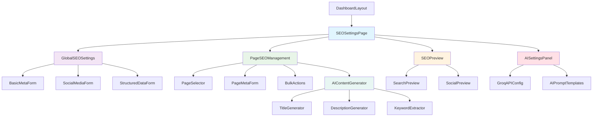

# SEO Settings for Timber Craft Commerce Hub

## Overview

This document outlines the design for implementing comprehensive SEO settings management within the dashboard of the Timber Craft Commerce Hub. The feature will allow administrators to manage SEO metadata for the entire website and individual pages, improving search engine visibility and organic traffic generation.

### Business Value
- Improved search engine rankings and organic traffic
- Centralized SEO management for all website pages
- Better control over how content appears in search results
- Support for Open Graph and Twitter Card metadata
- Enhanced brand visibility and click-through rates

## Technology Stack & Dependencies

### Core Technologies
- **Frontend Framework**: React 18.3.1 + TypeScript 5.5.3
- **Build Tool**: Vite 5.4.1
- **UI Library**: shadcn-ui (Radix UI + Tailwind CSS)
- **Form Management**: React Hook Form 7.53.0 + Zod 3.23.8
- **State Management**: React Query 5.56.2
- **Routing**: React Router DOM 6.26.2

### Additional Dependencies
- **File Upload**: File handling for meta images
- **Rich Text Editor**: For meta descriptions (optional enhancement)
- **URL Validation**: Enhanced URL validation utilities
- **AI Integration**: Groq SDK 0.20.1 for AI-powered content generation
- **Environment Variables**: API key management for GroqCloud

## Component Architecture

### Component Hierarchy



### Component Definitions

#### SEOSettingsPage
**Purpose**: Main container component for SEO settings management
**Props Interface**:
```typescript
interface SEOSettingsPageProps {
  defaultTab?: 'global' | 'pages' | 'analytics';
}
```

#### GlobalSEOSettings
**Purpose**: Manages site-wide SEO configurations
**State Management**:
- Default meta titles and descriptions
- Global keywords and schema markup
- Social media defaults
- Favicon and default images

#### PageSEOManagement
**Purpose**: Handles individual page SEO settings
**Features**:
- Page-specific meta tags
- Custom URL slugs
- Page status management
- Bulk operations

#### SEOPreview
**Purpose**: Live preview of SEO appearance
**Preview Types**:
- Google search results
- Facebook Open Graph
- Twitter Cards
- LinkedIn sharing

#### AISettingsPanel
**Purpose**: Configuration for AI-powered content generation
**Features**:
- GroqCloud API key management
- AI model selection and parameters
- Custom prompt templates
- Generation history and analytics

#### AIContentGenerator
**Purpose**: AI-powered SEO content generation
**Capabilities**:
- Title optimization based on content analysis
- Meta description generation with keyword integration
- Keyword extraction and suggestion
- Multi-language content generation

## Data Models & Storage Strategy

### SEO Data Structures

```typescript
interface GlobalSEOSettings {
  id: string;
  siteName: string;
  defaultTitle: string;
  titleSeparator: string;
  defaultDescription: string;
  defaultKeywords: string[];
  canonicalURL: string;
  robotsTxt: string;
  favicon: {
    ico: string;
    png16: string;
    png32: string;
    apple180: string;
  };
  socialMedia: {
    ogImage: string;
    ogType: string;
    twitterCard: string;
    twitterSite: string;
    facebookAppId?: string;
  };
  structuredData: {
    organizationSchema: OrganizationSchema;
    websiteSchema: WebsiteSchema;
  };
  analytics: {
    googleAnalyticsId?: string;
    googleSearchConsole?: string;
    bingWebmasterTools?: string;
  };
  updatedAt: string;
  updatedBy: string;
}

interface PageSEOSettings {
  id: string;
  pageId: string;
  pagePath: string;
  pageTitle: string;
  metaTitle?: string;
  metaDescription?: string;
  keywords: string[];
  canonicalUrl?: string;
  noIndex: boolean;
  noFollow: boolean;
  customMeta: MetaTag[];
  ogTitle?: string;
  ogDescription?: string;
  ogImage?: string;
  twitterTitle?: string;
  twitterDescription?: string;
  twitterImage?: string;
  priority: number;
  changeFreq: 'always' | 'hourly' | 'daily' | 'weekly' | 'monthly' | 'yearly' | 'never';
  lastModified: string;
  status: 'published' | 'draft' | 'archived';
}

interface MetaTag {
  name?: string;
  property?: string;
  content: string;
  httpEquiv?: string;
}

interface OrganizationSchema {
  '@type': 'Organization';
  name: string;
  url: string;
  logo: string;
  contactPoint: ContactPoint[];
  address: PostalAddress;
  sameAs: string[];
}
```

### Storage Implementation

#### Local Storage Strategy
```typescript
class SEOStorageManager {
  private static STORAGE_KEYS = {
    GLOBAL_SEO: 'timber_hub_global_seo',
    PAGE_SEO: 'timber_hub_page_seo',
    SEO_CACHE: 'timber_hub_seo_cache'
  } as const;

  static saveGlobalSettings(settings: GlobalSEOSettings): void;
  static loadGlobalSettings(): GlobalSEOSettings | null;
  static savePageSettings(settings: PageSEOSettings[]): void;
  static loadPageSettings(): PageSEOSettings[];
  static clearCache(): void;
}
```

## Component Implementation Details

### SEOSettingsPage Component

```typescript
export const SEOSettingsPage: React.FC = () => {
  const [activeTab, setActiveTab] = useState<'global' | 'pages' | 'analytics'>('global');
  const [globalSettings, setGlobalSettings] = useState<GlobalSEOSettings>();
  const [pageSettings, setPageSettings] = useState<PageSEOSettings[]>([]);

  return (
    <div className="space-y-6">
      <div className="flex items-center justify-between">
        <div>
          <h1 className="text-3xl font-playfair font-bold">SEO Settings</h1>
          <p className="text-muted-foreground">
            Manage search engine optimization for your website
          </p>
        </div>
        <div className="flex gap-2">
          <Button variant="outline" onClick={handleExportSettings}>
            Export Settings
          </Button>
          <Button onClick={handleSaveSettings}>
            Save Changes
          </Button>
        </div>
      </div>

      <Tabs value={activeTab} onValueChange={setActiveTab}>
        <TabsList className="grid w-full grid-cols-3">
          <TabsTrigger value="global">Global Settings</TabsTrigger>
          <TabsTrigger value="pages">Page Management</TabsTrigger>
          <TabsTrigger value="analytics">Analytics & Tools</TabsTrigger>
        </TabsList>

        <TabsContent value="global">
          <GlobalSEOSettings 
            settings={globalSettings}
            onUpdate={setGlobalSettings}
          />
        </TabsContent>

        <TabsContent value="pages">
          <PageSEOManagement 
            pages={pageSettings}
            onUpdate={setPageSettings}
          />
        </TabsContent>

        <TabsContent value="analytics">
          <AnalyticsSettings 
            settings={globalSettings?.analytics}
            onUpdate={handleAnalyticsUpdate}
          />
        </TabsContent>
      </Tabs>
    </div>
  );
};
```

### GlobalSEOSettings Form Component

```typescript
export const GlobalSEOSettings: React.FC<GlobalSEOSettingsProps> = ({ 
  settings, 
  onUpdate 
}) => {
  const form = useForm<GlobalSEOSettings>({
    resolver: zodResolver(globalSEOSchema),
    defaultValues: settings
  });

  return (
    <Form {...form}>
      <div className="grid gap-6 md:grid-cols-2">
        <Card>
          <CardHeader>
            <CardTitle>Basic Information</CardTitle>
            <CardDescription>
              Core website metadata that appears across all pages
            </CardDescription>
          </CardHeader>
          <CardContent className="space-y-4">
            <FormField
              control={form.control}
              name="siteName"
              render={({ field }) => (
                <FormItem>
                  <FormLabel>Site Name</FormLabel>
                  <FormControl>
                    <Input placeholder="Timber Craft Commerce Hub" {...field} />
                  </FormControl>
                  <FormMessage />
                </FormItem>
              )}
            />
            
            <FormField
              control={form.control}
              name="defaultTitle"
              render={({ field }) => (
                <FormItem>
                  <FormLabel>Default Title Template</FormLabel>
                  <FormControl>
                    <Input 
                      placeholder="%page% | Timber Craft Commerce Hub" 
                      {...field} 
                    />
                  </FormControl>
                  <FormDescription>
                    Use %page% as placeholder for page names
                  </FormDescription>
                  <FormMessage />
                </FormItem>
              )}
            />

            <FormField
              control={form.control}
              name="defaultDescription"
              render={({ field }) => (
                <FormItem>
                  <FormLabel>Default Meta Description</FormLabel>
                  <FormControl>
                    <Textarea 
                      placeholder="Premium timber and woodcraft solutions..."
                      className="resize-none"
                      rows={3}
                      {...field} 
                    />
                  </FormControl>
                  <FormDescription>
                    150-160 characters recommended
                  </FormDescription>
                  <FormMessage />
                </FormItem>
              )}
            />
          </CardContent>
        </Card>

        <Card>
          <CardHeader>
            <CardTitle>Social Media</CardTitle>
            <CardDescription>
              Configure how your site appears when shared on social platforms
            </CardDescription>
          </CardHeader>
          <CardContent className="space-y-4">
            <FormField
              control={form.control}
              name="socialMedia.ogImage"
              render={({ field }) => (
                <FormItem>
                  <FormLabel>Default Social Image</FormLabel>
                  <FormControl>
                    <div className="space-y-2">
                      <Input 
                        type="file" 
                        accept="image/*"
                        onChange={handleImageUpload}
                      />
                      {field.value && (
                        
                      )}
                    </div>
                  </FormControl>
                  <FormDescription>
                    Recommended: 1200x630px
                  </FormDescription>
                  <FormMessage />
                </FormItem>
              )}
            />
          </CardContent>
        </Card>
      </div>
    </Form>
  );
};
```

### PageSEOManagement Component

```typescript
export const PageSEOManagement: React.FC<PageSEOManagementProps> = ({
  pages,
  onUpdate
}) => {
  const [selectedPage, setSelectedPage] = useState<string | null>(null);
  const [searchTerm, setSearchTerm] = useState('');
  const [statusFilter, setStatusFilter] = useState<string>('all');

  const filteredPages = useMemo(() => {
    return pages.filter(page => {
      const matchesSearch = page.pageTitle.toLowerCase().includes(searchTerm.toLowerCase()) ||
                           page.pagePath.toLowerCase().includes(searchTerm.toLowerCase());
      const matchesStatus = statusFilter === 'all' || page.status === statusFilter;
      return matchesSearch && matchesStatus;
    });
  }, [pages, searchTerm, statusFilter]);

  return (
    <div className="space-y-6">
      <div className="flex items-center gap-4">
        <div className="flex-1">
          <Input
            placeholder="Search pages..."
            value={searchTerm}
            onChange={(e) => setSearchTerm(e.target.value)}
            className="max-w-md"
          />
        </div>
        <Select value={statusFilter} onValueChange={setStatusFilter}>
          <SelectTrigger className="w-[180px]">
            <SelectValue placeholder="Filter by status" />
          </SelectTrigger>
          <SelectContent>
            <SelectItem value="all">All Pages</SelectItem>
            <SelectItem value="published">Published</SelectItem>
            <SelectItem value="draft">Draft</SelectItem>
            <SelectItem value="archived">Archived</SelectItem>
          </SelectContent>
        </Select>
        <Button onClick={handleBulkSEOGeneration}>
          Generate SEO for All
        </Button>
      </div>

      <div className="grid gap-4 md:grid-cols-2">
        <Card>
          <CardHeader>
            <CardTitle>Page List</CardTitle>
            <CardDescription>
              Select a page to edit its SEO settings
            </CardDescription>
          </CardHeader>
          <CardContent>
            <ScrollArea className="h-[600px]">
              <div className="space-y-2">
                {filteredPages.map((page) => (
                  <div
                    key={page.id}
                    className={cn(
                      "p-3 rounded-lg border cursor-pointer transition-colors",
                      selectedPage === page.id && "border-primary bg-primary/5"
                    )}
                    onClick={() => setSelectedPage(page.id)}
                  >
                    <div className="flex items-center justify-between">
                      <div>
                        <p className="font-medium">{page.pageTitle}</p>
                        <p className="text-sm text-muted-foreground">{page.pagePath}</p>
                      </div>
                      <Badge variant={page.status === 'published' ? 'default' : 'secondary'}>
                        {page.status}
                      </Badge>
                    </div>
                    {page.metaDescription && (
                      <p className="text-xs text-muted-foreground mt-1 line-clamp-2">
                        {page.metaDescription}
                      </p>
                    )}
                  </div>
                ))}
              </div>
            </ScrollArea>
          </CardContent>
        </Card>

        <Card>
          <CardHeader>
            <CardTitle>Page SEO Editor</CardTitle>
            <CardDescription>
              Edit SEO settings for the selected page
            </CardDescription>
          </CardHeader>
          <CardContent>
            {selectedPage ? (
              <PageSEOEditor 
                page={pages.find(p => p.id === selectedPage)!}
                onUpdate={handlePageUpdate}
              />
            ) : (
              <div className="flex items-center justify-center h-[400px] text-muted-foreground">
                Select a page to edit its SEO settings
              </div>
            )}
          </CardContent>
        </Card>
      </div>
    </div>
  );
};
```

### SEO Preview Component

```typescript
export const SEOPreview: React.FC<SEOPreviewProps> = ({ 
  title, 
  description, 
  url, 
  image 
}) => {
  return (
    <div className="space-y-6">
      <Card>
        <CardHeader>
          <CardTitle>Google Search Preview</CardTitle>
        </CardHeader>
        <CardContent>
          <div className="border rounded-lg p-4 bg-background">
            <div className="space-y-1">
              <div className="text-blue-600 hover:underline cursor-pointer">
                <h3 className="text-lg">{title}</h3>
              </div>
              <div className="text-green-700 text-sm">{url}</div>
              <p className="text-gray-600 text-sm">{description}</p>
            </div>
          </div>
        </CardContent>
      </Card>

      <Card>
        <CardHeader>
          <CardTitle>Social Media Preview</CardTitle>
        </CardHeader>
        <CardContent>
          <Tabs defaultValue="facebook">
            <TabsList>
              <TabsTrigger value="facebook">Facebook</TabsTrigger>
              <TabsTrigger value="twitter">Twitter</TabsTrigger>
              <TabsTrigger value="linkedin">LinkedIn</TabsTrigger>
            </TabsList>
            
            <TabsContent value="facebook">
              <div className="border rounded-lg overflow-hidden max-w-md">
                {image && (
                  
                )}
                <div className="p-3 bg-gray-50">
                  <div className="text-xs text-gray-500 uppercase">timber-craft-hub.com</div>
                  <h4 className="font-semibold text-gray-900 mt-1">{title}</h4>
                  <p className="text-gray-600 text-sm mt-1">{description}</p>
                </div>
              </div>
            </TabsContent>
          </Tabs>
        </CardContent>
      </Card>
    </div>
  );
};
```

## Routing & Navigation

### Dashboard Integration

The SEO Settings will be integrated into the existing dashboard navigation structure:

```typescript
// Update to DashboardLayout.tsx
<SidebarGroup>
  <SidebarGroupLabel>Settings</SidebarGroupLabel>
  <SidebarGroupContent>
    <SidebarMenu>
      <SidebarMenuItem>
        <SidebarMenuButton asChild tooltip="SEO Settings">
          <Link to="/dashboard/seo">
            <Search />
            <span>SEO Settings</span>
          </Link>
        </SidebarMenuButton>
      </SidebarMenuItem>
      <SidebarMenuItem>
        <SidebarMenuButton asChild tooltip="General Settings">
          <Link to="/dashboard/settings">
            <Settings />
            <span>General Settings</span>
          </Link>
        </SidebarMenuButton>
      </SidebarMenuItem>
    </SidebarMenu>
  </SidebarGroupContent>
</SidebarGroup>
```

### Route Configuration

```typescript
// Add to App.tsx
<Route path="/dashboard/seo" element={<SEOSettingsPage />} />
<Route path="/dashboard/seo/pages/:pageId" element={<PageSEODetailPage />} />
```

## Business Logic Layer

### SEO Data Management

```typescript
class SEOManager {
  static generatePageSEO(page: Page): PageSEOSettings {
    // Auto-generate SEO based on page content
    return {
      id: generateId(),
      pageId: page.id,
      pagePath: page.path,
      pageTitle: page.title,
      metaTitle: this.generateMetaTitle(page),
      metaDescription: this.generateMetaDescription(page),
      keywords: this.extractKeywords(page),
      priority: this.calculatePriority(page),
      changeFreq: this.determineChangeFrequency(page),
      lastModified: new Date().toISOString(),
      status: 'draft'
    };
  }

  static validateSEOSettings(settings: SEOSettings): ValidationResult {
    // Comprehensive SEO validation
    const issues: SEOIssue[] = [];
    
    if (settings.metaTitle.length > 60) {
      issues.push({
        type: 'warning',
        field: 'metaTitle',
        message: 'Title exceeds recommended 60 characters'
      });
    }
    
    if (settings.metaDescription.length > 160) {
      issues.push({
        type: 'warning',
        field: 'metaDescription',
        message: 'Description exceeds recommended 160 characters'
      });
    }

    return { isValid: issues.length === 0, issues };
  }

  static generateSitemap(pages: PageSEOSettings[]): string {
    // Generate XML sitemap from page settings
    const urls = pages
      .filter(page => page.status === 'published' && !page.noIndex)
      .map(page => ({
        loc: `${window.location.origin}${page.pagePath}`,
        lastmod: page.lastModified,
        changefreq: page.changeFreq,
        priority: page.priority
      }));

    return this.buildSitemapXML(urls);
  }
}
```

### Analytics Integration

```typescript
interface SEOAnalytics {
  pageViews: Record<string, number>;
  searchRankings: Record<string, SearchRanking[]>;
  clickThroughRates: Record<string, number>;
  topKeywords: KeywordData[];
  crawlErrors: CrawlError[];
  indexationStatus: IndexationStatus[];
}

class SEOAnalyticsService {
  static async fetchPageMetrics(pageId: string): Promise<PageMetrics> {
    // Integration with Google Analytics, Search Console
    // Return page performance data
  }
  
  static async validateStructuredData(url: string): Promise<StructuredDataValidation> {
    // Validate schema markup
    // Return validation results
  }
  
  static async checkPageSpeed(url: string): Promise<PageSpeedMetrics> {
    // Check Core Web Vitals
    // Return performance metrics
  }
}
```

## Implementation Phases

### Phase 1: Core SEO Management (Week 1-2)
- Basic SEO settings form components
- Global and page-level metadata management
- Local storage implementation
- Basic validation and preview

### Phase 2: Advanced Features (Week 3-4)
- Social media previews
- Structured data management
- Bulk operations and SEO generation
- Import/export functionality

### Phase 3: Analytics Integration (Week 5-6)
- SEO performance dashboard
- Keyword tracking
- Crawl error monitoring
- Page speed insights

### Phase 4: Automation & AI (Week 7-8)
- AI-powered SEO suggestions
- Automated meta generation
- Content optimization recommendations
- Competitive analysis tools

## Testing Strategy

### Unit Testing
- Form validation logic
- SEO data transformations
- Preview generation
- Storage operations

### Integration Testing
- Dashboard navigation flow
- Form submissions and data persistence
- Preview accuracy
- Bulk operations

### SEO Testing
- Meta tag rendering validation
- Structured data validation
- Sitemap generation testing
- Social media sharing verification

### Performance Testing
- Large dataset handling
- Form responsiveness
- Storage limits testing
- Preview generation speed

### Accessibility Testing
- Form accessibility compliance
- Screen reader compatibility
- Keyboard navigation
- Color contrast validation- Facebook Open Graph
- Twitter Cards
- LinkedIn sharing

## Data Models & Storage Strategy

### SEO Data Structures

```typescript
interface GlobalSEOSettings {
  id: string;
  siteName: string;
  defaultTitle: string;
  titleSeparator: string;
  defaultDescription: string;
  defaultKeywords: string[];
  canonicalURL: string;
  robotsTxt: string;
  favicon: {
    ico: string;
    png16: string;
    png32: string;
    apple180: string;
  };
  socialMedia: {
    ogImage: string;
    ogType: string;
    twitterCard: string;
    twitterSite: string;
    facebookAppId?: string;
  };
  structuredData: {
    organizationSchema: OrganizationSchema;
    websiteSchema: WebsiteSchema;
  };
  analytics: {
    googleAnalyticsId?: string;
    googleSearchConsole?: string;
    bingWebmasterTools?: string;
  };
  updatedAt: string;
  updatedBy: string;
}

interface PageSEOSettings {
  id: string;
  pageId: string;
  pagePath: string;
  pageTitle: string;
  metaTitle?: string;
  metaDescription?: string;
  keywords: string[];
  canonicalUrl?: string;
  noIndex: boolean;
  noFollow: boolean;
  customMeta: MetaTag[];
  ogTitle?: string;
  ogDescription?: string;
  ogImage?: string;
  twitterTitle?: string;
  twitterDescription?: string;
  twitterImage?: string;
  priority: number;
  changeFreq: 'always' | 'hourly' | 'daily' | 'weekly' | 'monthly' | 'yearly' | 'never';
  lastModified: string;
  status: 'published' | 'draft' | 'archived';
}

interface MetaTag {
  name?: string;
  property?: string;
  content: string;
  httpEquiv?: string;
}

interface OrganizationSchema {
  '@type': 'Organization';
  name: string;
  url: string;
  logo: string;
  contactPoint: ContactPoint[];
  address: PostalAddress;
  sameAs: string[];
}
```

### Storage Implementation

#### Local Storage Strategy
```typescript
class SEOStorageManager {
  private static STORAGE_KEYS = {
    GLOBAL_SEO: 'timber_hub_global_seo',
    PAGE_SEO: 'timber_hub_page_seo',
    SEO_CACHE: 'timber_hub_seo_cache'
  } as const;

  static saveGlobalSettings(settings: GlobalSEOSettings): void;
  static loadGlobalSettings(): GlobalSEOSettings | null;
  static savePageSettings(settings: PageSEOSettings[]): void;
  static loadPageSettings(): PageSEOSettings[];
  static clearCache(): void;
}
```

## Component Implementation Details

### SEOSettingsPage Component

```typescript
export const SEOSettingsPage: React.FC = () => {
  const [activeTab, setActiveTab] = useState<'global' | 'pages' | 'analytics'>('global');
  const [globalSettings, setGlobalSettings] = useState<GlobalSEOSettings>();
  const [pageSettings, setPageSettings] = useState<PageSEOSettings[]>([]);

  return (
    <div className="space-y-6">
      <div className="flex items-center justify-between">
        <div>
          <h1 className="text-3xl font-playfair font-bold">SEO Settings</h1>
          <p className="text-muted-foreground">
            Manage search engine optimization for your website
          </p>
        </div>
        <div className="flex gap-2">
          <Button variant="outline" onClick={handleExportSettings}>
            Export Settings
          </Button>
          <Button onClick={handleSaveSettings}>
            Save Changes
          </Button>
        </div>
      </div>

      <Tabs value={activeTab} onValueChange={setActiveTab}>
        <TabsList className="grid w-full grid-cols-3">
          <TabsTrigger value="global">Global Settings</TabsTrigger>
          <TabsTrigger value="pages">Page Management</TabsTrigger>
          <TabsTrigger value="analytics">Analytics & Tools</TabsTrigger>
        </TabsList>

        <TabsContent value="global">
          <GlobalSEOSettings 
            settings={globalSettings}
            onUpdate={setGlobalSettings}
          />
        </TabsContent>

        <TabsContent value="pages">
          <PageSEOManagement 
            pages={pageSettings}
            onUpdate={setPageSettings}
          />
        </TabsContent>

        <TabsContent value="analytics">
          <AnalyticsSettings 
            settings={globalSettings?.analytics}
            onUpdate={handleAnalyticsUpdate}
          />
        </TabsContent>
      </Tabs>
    </div>
  );
};
```

### GlobalSEOSettings Form Component

```typescript
export const GlobalSEOSettings: React.FC<GlobalSEOSettingsProps> = ({ 
  settings, 
  onUpdate 
}) => {
  const form = useForm<GlobalSEOSettings>({
    resolver: zodResolver(globalSEOSchema),
    defaultValues: settings
  });

  return (
    <Form {...form}>
      <div className="grid gap-6 md:grid-cols-2">
        <Card>
          <CardHeader>
            <CardTitle>Basic Information</CardTitle>
            <CardDescription>
              Core website metadata that appears across all pages
            </CardDescription>
          </CardHeader>
          <CardContent className="space-y-4">
            <FormField
              control={form.control}
              name="siteName"
              render={({ field }) => (
                <FormItem>
                  <FormLabel>Site Name</FormLabel>
                  <FormControl>
                    <Input placeholder="Timber Craft Commerce Hub" {...field} />
                  </FormControl>
                  <FormMessage />
                </FormItem>
              )}
            />
            
            <FormField
              control={form.control}
              name="defaultTitle"
              render={({ field }) => (
                <FormItem>
                  <FormLabel>Default Title Template</FormLabel>
                  <FormControl>
                    <Input 
                      placeholder="%page% | Timber Craft Commerce Hub" 
                      {...field} 
                    />
                  </FormControl>
                  <FormDescription>
                    Use %page% as placeholder for page names
                  </FormDescription>
                  <FormMessage />
                </FormItem>
              )}
            />

            <FormField
              control={form.control}
              name="defaultDescription"
              render={({ field }) => (
                <FormItem>
                  <FormLabel>Default Meta Description</FormLabel>
                  <FormControl>
                    <Textarea 
                      placeholder="Premium timber and woodcraft solutions..."
                      className="resize-none"
                      rows={3}
                      {...field} 
                    />
                  </FormControl>
                  <FormDescription>
                    150-160 characters recommended
                  </FormDescription>
                  <FormMessage />
                </FormItem>
              )}
            />
          </CardContent>
        </Card>

        <Card>
          <CardHeader>
            <CardTitle>Social Media</CardTitle>
            <CardDescription>
              Configure how your site appears when shared on social platforms
            </CardDescription>
          </CardHeader>
          <CardContent className="space-y-4">
            <FormField
              control={form.control}
              name="socialMedia.ogImage"
              render={({ field }) => (
                <FormItem>
                  <FormLabel>Default Social Image</FormLabel>
                  <FormControl>
                    <div className="space-y-2">
                      <Input 
                        type="file" 
                        accept="image/*"
                        onChange={handleImageUpload}
                      />
                      {field.value && (
                        
                      )}
                    </div>
                  </FormControl>
                  <FormDescription>
                    Recommended: 1200x630px
                  </FormDescription>
                  <FormMessage />
                </FormItem>
              )}
            />
          </CardContent>
        </Card>
      </div>
    </Form>
  );
};
```

### PageSEOManagement Component

```typescript
export const PageSEOManagement: React.FC<PageSEOManagementProps> = ({
  pages,
  onUpdate
}) => {
  const [selectedPage, setSelectedPage] = useState<string | null>(null);
  const [searchTerm, setSearchTerm] = useState('');
  const [statusFilter, setStatusFilter] = useState<string>('all');

  const filteredPages = useMemo(() => {
    return pages.filter(page => {
      const matchesSearch = page.pageTitle.toLowerCase().includes(searchTerm.toLowerCase()) ||
                           page.pagePath.toLowerCase().includes(searchTerm.toLowerCase());
      const matchesStatus = statusFilter === 'all' || page.status === statusFilter;
      return matchesSearch && matchesStatus;
    });
  }, [pages, searchTerm, statusFilter]);

  return (
    <div className="space-y-6">
      <div className="flex items-center gap-4">
        <div className="flex-1">
          <Input
            placeholder="Search pages..."
            value={searchTerm}
            onChange={(e) => setSearchTerm(e.target.value)}
            className="max-w-md"
          />
        </div>
        <Select value={statusFilter} onValueChange={setStatusFilter}>
          <SelectTrigger className="w-[180px]">
            <SelectValue placeholder="Filter by status" />
          </SelectTrigger>
          <SelectContent>
            <SelectItem value="all">All Pages</SelectItem>
            <SelectItem value="published">Published</SelectItem>
            <SelectItem value="draft">Draft</SelectItem>
            <SelectItem value="archived">Archived</SelectItem>
          </SelectContent>
        </Select>
        <Button onClick={handleBulkSEOGeneration}>
          Generate SEO for All
        </Button>
      </div>

      <div className="grid gap-4 md:grid-cols-2">
        <Card>
          <CardHeader>
            <CardTitle>Page List</CardTitle>
            <CardDescription>
              Select a page to edit its SEO settings
            </CardDescription>
          </CardHeader>
          <CardContent>
            <ScrollArea className="h-[600px]">
              <div className="space-y-2">
                {filteredPages.map((page) => (
                  <div
                    key={page.id}
                    className={cn(
                      "p-3 rounded-lg border cursor-pointer transition-colors",
                      selectedPage === page.id && "border-primary bg-primary/5"
                    )}
                    onClick={() => setSelectedPage(page.id)}
                  >
                    <div className="flex items-center justify-between">
                      <div>
                        <p className="font-medium">{page.pageTitle}</p>
                        <p className="text-sm text-muted-foreground">{page.pagePath}</p>
                      </div>
                      <Badge variant={page.status === 'published' ? 'default' : 'secondary'}>
                        {page.status}
                      </Badge>
                    </div>
                    {page.metaDescription && (
                      <p className="text-xs text-muted-foreground mt-1 line-clamp-2">
                        {page.metaDescription}
                      </p>
                    )}
                  </div>
                ))}
              </div>
            </ScrollArea>
          </CardContent>
        </Card>

        <Card>
          <CardHeader>
            <CardTitle>Page SEO Editor</CardTitle>
            <CardDescription>
              Edit SEO settings for the selected page
            </CardDescription>
          </CardHeader>
          <CardContent>
            {selectedPage ? (
              <PageSEOEditor 
                page={pages.find(p => p.id === selectedPage)!}
                onUpdate={handlePageUpdate}
              />
            ) : (
              <div className="flex items-center justify-center h-[400px] text-muted-foreground">
                Select a page to edit its SEO settings
              </div>
            )}
          </CardContent>
        </Card>
      </div>
    </div>
  );
};
```

### SEO Preview Component

```typescript
export const SEOPreview: React.FC<SEOPreviewProps> = ({ 
  title, 
  description, 
  url, 
  image 
}) => {
  return (
    <div className="space-y-6">
      <Card>
        <CardHeader>
          <CardTitle>Google Search Preview</CardTitle>
        </CardHeader>
        <CardContent>
          <div className="border rounded-lg p-4 bg-background">
            <div className="space-y-1">
              <div className="text-blue-600 hover:underline cursor-pointer">
                <h3 className="text-lg">{title}</h3>
              </div>
              <div className="text-green-700 text-sm">{url}</div>
              <p className="text-gray-600 text-sm">{description}</p>
            </div>
          </div>
        </CardContent>
      </Card>

      <Card>
        <CardHeader>
          <CardTitle>Social Media Preview</CardTitle>
        </CardHeader>
        <CardContent>
          <Tabs defaultValue="facebook">
            <TabsList>
              <TabsTrigger value="facebook">Facebook</TabsTrigger>
              <TabsTrigger value="twitter">Twitter</TabsTrigger>
              <TabsTrigger value="linkedin">LinkedIn</TabsTrigger>
            </TabsList>
            
            <TabsContent value="facebook">
              <div className="border rounded-lg overflow-hidden max-w-md">
                {image && (
                  
                )}
                <div className="p-3 bg-gray-50">
                  <div className="text-xs text-gray-500 uppercase">timber-craft-hub.com</div>
                  <h4 className="font-semibold text-gray-900 mt-1">{title}</h4>
                  <p className="text-gray-600 text-sm mt-1">{description}</p>
                </div>
              </div>
            </TabsContent>
          </Tabs>
        </CardContent>
      </Card>
    </div>
  );
};
```

## Routing & Navigation

### Dashboard Integration

The SEO Settings will be integrated into the existing dashboard navigation structure:

```typescript
// Update to DashboardLayout.tsx
<SidebarGroup>
  <SidebarGroupLabel>Settings</SidebarGroupLabel>
  <SidebarGroupContent>
    <SidebarMenu>
      <SidebarMenuItem>
        <SidebarMenuButton asChild tooltip="SEO Settings">
          <Link to="/dashboard/seo">
            <Search />
            <span>SEO Settings</span>
          </Link>
        </SidebarMenuButton>
      </SidebarMenuItem>
      <SidebarMenuItem>
        <SidebarMenuButton asChild tooltip="General Settings">
          <Link to="/dashboard/settings">
            <Settings />
            <span>General Settings</span>
          </Link>
        </SidebarMenuButton>
      </SidebarMenuItem>
    </SidebarMenu>
  </SidebarGroupContent>
</SidebarGroup>
```

### Route Configuration

```typescript
// Add to App.tsx
<Route path="/dashboard/seo" element={<SEOSettingsPage />} />
<Route path="/dashboard/seo/pages/:pageId" element={<PageSEODetailPage />} />
```

## Business Logic Layer

### SEO Data Management

```typescript
class SEOManager {
  static generatePageSEO(page: Page): PageSEOSettings {
    // Auto-generate SEO based on page content
    return {
      id: generateId(),
      pageId: page.id,
      pagePath: page.path,
      pageTitle: page.title,
      metaTitle: this.generateMetaTitle(page),
      metaDescription: this.generateMetaDescription(page),
      keywords: this.extractKeywords(page),
      priority: this.calculatePriority(page),
      changeFreq: this.determineChangeFrequency(page),
      lastModified: new Date().toISOString(),
      status: 'draft'
    };
  }

  static validateSEOSettings(settings: SEOSettings): ValidationResult {
    // Comprehensive SEO validation
    const issues: SEOIssue[] = [];
    
    if (settings.metaTitle.length > 60) {
      issues.push({
        type: 'warning',
        field: 'metaTitle',
        message: 'Title exceeds recommended 60 characters'
      });
    }
    
    if (settings.metaDescription.length > 160) {
      issues.push({
        type: 'warning',
        field: 'metaDescription',
        message: 'Description exceeds recommended 160 characters'
      });
    }

    return { isValid: issues.length === 0, issues };
  }

  static generateSitemap(pages: PageSEOSettings[]): string {
    // Generate XML sitemap from page settings
    const urls = pages
      .filter(page => page.status === 'published' && !page.noIndex)
      .map(page => ({
        loc: `${window.location.origin}${page.pagePath}`,
        lastmod: page.lastModified,
        changefreq: page.changeFreq,
        priority: page.priority
      }));

    return this.buildSitemapXML(urls);
  }
}
```

### Analytics Integration

```typescript
interface SEOAnalytics {
  pageViews: Record<string, number>;
  searchRankings: Record<string, SearchRanking[]>;
  clickThroughRates: Record<string, number>;
  topKeywords: KeywordData[];
  crawlErrors: CrawlError[];
  indexationStatus: IndexationStatus[];
}

class SEOAnalyticsService {
  static async fetchPageMetrics(pageId: string): Promise<PageMetrics> {
    // Integration with Google Analytics, Search Console
    // Return page performance data
  }
  
  static async validateStructuredData(url: string): Promise<StructuredDataValidation> {
    // Validate schema markup
    // Return validation results
  }
  
  static async checkPageSpeed(url: string): Promise<PageSpeedMetrics> {
    // Check Core Web Vitals
    // Return performance metrics
  }
}
```

## Implementation Phases

### Phase 1: Core SEO Management (Week 1-2)
- Basic SEO settings form components
- Global and page-level metadata management
- Local storage implementation
- Basic validation and preview

### Phase 2: Advanced Features (Week 3-4)
- Social media previews
- Structured data management
- Bulk operations and SEO generation
- Import/export functionality

### Phase 3: Analytics Integration (Week 5-6)
- SEO performance dashboard
- Keyword tracking
- Crawl error monitoring
- Page speed insights

### Phase 4: Automation & AI (Week 7-8)
- AI-powered SEO suggestions
- Automated meta generation
- Content optimization recommendations
- Competitive analysis tools

## Testing Strategy

### Unit Testing
- Form validation logic
- SEO data transformations
- Preview generation
- Storage operations

### Integration Testing
- Dashboard navigation flow
- Form submissions and data persistence
- Preview accuracy
- Bulk operations

### SEO Testing
- Meta tag rendering validation
- Structured data validation
- Sitemap generation testing
- Social media sharing verification

### Performance Testing
- Large dataset handling
- Form responsiveness
- Storage limits testing
- Preview generation speed

### Accessibility Testing
- Form accessibility compliance
- Screen reader compatibility
- Keyboard navigation
- Color contrast validation

## AI-Powered Content Generation

### GroqCloud Integration

The SEO settings will include AI-powered content generation using the GroqCloud API to automatically create optimized titles, descriptions, and keywords.

#### AI Configuration Interface

```typescript
interface AIPromptTemplate {
  id: string;
  name: string;
  type: 'title' | 'description' | 'keywords';
  prompt: string;
  variables: string[];
  isDefault: boolean;
}

interface AIGenerationRequest {
  type: 'title' | 'description' | 'keywords';
  content: string;
  keywords?: string[];
  maxLength?: number;
  tone?: 'professional' | 'casual' | 'technical' | 'marketing';
  industry?: string;
}

interface AIGenerationResponse {
  success: boolean;
  content: string;
  alternatives?: string[];
  usedTokens: number;
  model: string;
  timestamp: string;
}
```

#### GroqCloud Service Implementation

```typescript
import Groq from "groq-sdk";

class GroqSEOService {
  private groq: Groq;
  private readonly defaultModel = "llama3-8b-8192";
  
  constructor(apiKey: string) {
    this.groq = new Groq({ 
      apiKey: apiKey,
      dangerouslyAllowBrowser: true // For client-side usage
    });
  }

  async generateSEOTitle(request: AIGenerationRequest): Promise<AIGenerationResponse> {
    try {
      const prompt = this.buildTitlePrompt(request);
      
      const completion = await this.groq.chat.completions.create({
        messages: [
          {
            role: "system",
            content: "You are an SEO expert specializing in creating optimized titles for timber and woodcraft commerce websites. Create compelling, keyword-rich titles that drive clicks while staying under 60 characters."
          },
          {
            role: "user",
            content: prompt
          }
        ],
        model: this.defaultModel,
        max_tokens: 100,
        temperature: 0.7
      });

      const generatedContent = completion.choices[0]?.message?.content || "";
      
      return {
        success: true,
        content: this.extractTitle(generatedContent),
        alternatives: this.extractAlternatives(generatedContent),
        usedTokens: completion.usage?.total_tokens || 0,
        model: this.defaultModel,
        timestamp: new Date().toISOString()
      };
    } catch (error) {
      return {
        success: false,
        content: "",
        usedTokens: 0,
        model: this.defaultModel,
        timestamp: new Date().toISOString()
      };
    }
  }

  async generateMetaDescription(request: AIGenerationRequest): Promise<AIGenerationResponse> {
    try {
      const prompt = this.buildDescriptionPrompt(request);
      
      const completion = await this.groq.chat.completions.create({
        messages: [
          {
            role: "system",
            content: "You are an SEO expert creating meta descriptions for timber and woodcraft commerce. Write compelling descriptions that include keywords and drive clicks while staying under 160 characters."
          },
          {
            role: "user",
            content: prompt
          }
        ],
        model: this.defaultModel,
        max_tokens: 150,
        temperature: 0.6
      });

      const generatedContent = completion.choices[0]?.message?.content || "";
      
      return {
        success: true,
        content: this.extractDescription(generatedContent),
        alternatives: this.extractAlternatives(generatedContent),
        usedTokens: completion.usage?.total_tokens || 0,
        model: this.defaultModel,
        timestamp: new Date().toISOString()
      };
    } catch (error) {
      return {
        success: false,
        content: "",
        usedTokens: 0,
        model: this.defaultModel,
        timestamp: new Date().toISOString()
      };
    }
  }

  async extractKeywords(content: string): Promise<AIGenerationResponse> {
    try {
      const completion = await this.groq.chat.completions.create({
        messages: [
          {
            role: "system",
            content: "You are an SEO keyword extraction expert. Extract the most relevant SEO keywords from the given content for a timber and woodcraft commerce website. Return only a comma-separated list of keywords."
          },
          {
            role: "user",
            content: `Extract SEO keywords from this content: ${content}`
          }
        ],
        model: this.defaultModel,
        max_tokens: 100,
        temperature: 0.3
      });

      const keywords = completion.choices[0]?.message?.content || "";
      
      return {
        success: true,
        content: keywords,
        usedTokens: completion.usage?.total_tokens || 0,
        model: this.defaultModel,
        timestamp: new Date().toISOString()
      };
    } catch (error) {
      return {
        success: false,
        content: "",
        usedTokens: 0,
        model: this.defaultModel,
        timestamp: new Date().toISOString()
      };
    }
  }

  private buildTitlePrompt(request: AIGenerationRequest): string {
    const { content, keywords, tone = 'professional' } = request;
    const keywordText = keywords?.length ? `Focus on these keywords: ${keywords.join(', ')}` : '';
    
    return `Create an SEO-optimized title for this content about timber/woodcraft:

Content: ${content}
${keywordText}
Tone: ${tone}
Industry: Timber and Woodcraft Commerce

Requirements:
- Maximum 60 characters
- Include primary keywords naturally
- Make it compelling and click-worthy
- Suitable for search engines

Provide the title only, no explanations.`;
  }

  private buildDescriptionPrompt(request: AIGenerationRequest): string {
    const { content, keywords, tone = 'professional' } = request;
    const keywordText = keywords?.length ? `Include these keywords: ${keywords.join(', ')}` : '';
    
    return `Create an SEO-optimized meta description for this content about timber/woodcraft:

Content: ${content}
${keywordText}
Tone: ${tone}
Industry: Timber and Woodcraft Commerce

Requirements:
- Maximum 160 characters
- Include keywords naturally
- Compelling and action-oriented
- Clear value proposition

Provide the description only, no explanations.`;
  }

  private extractTitle(content: string): string {
    // Clean and extract title from AI response
    return content.trim().replace(/^"|"$/g, '').substring(0, 60);
  }

  private extractDescription(content: string): string {
    // Clean and extract description from AI response
    return content.trim().replace(/^"|"$/g, '').substring(0, 160);
  }

  private extractAlternatives(content: string): string[] {
    // Extract alternative suggestions if provided
    const lines = content.split('\n').filter(line => line.trim().length > 0);
    return lines.slice(1, 4); // Return up to 3 alternatives
  }
}
```

#### AI Content Generator Component

```typescript
export const AIContentGenerator: React.FC<AIContentGeneratorProps> = ({
  pageContent,
  currentTitle,
  currentDescription,
  onTitleGenerated,
  onDescriptionGenerated,
  onKeywordsGenerated
}) => {
  const [isGenerating, setIsGenerating] = useState(false);
  const [groqService, setGroqService] = useState<GroqSEOService | null>(null);
  const [generationHistory, setGenerationHistory] = useState<AIGenerationResponse[]>([]);

  useEffect(() => {
    const apiKey = localStorage.getItem('groq_api_key');
    if (apiKey) {
      setGroqService(new GroqSEOService(apiKey));
    }
  }, []);

  const handleGenerateTitle = async () => {
    if (!groqService || !pageContent) return;
    
    setIsGenerating(true);
    try {
      const response = await groqService.generateSEOTitle({
        type: 'title',
        content: pageContent,
        tone: 'professional',
        industry: 'timber'
      });
      
      if (response.success) {
        onTitleGenerated(response.content);
        setGenerationHistory(prev => [response, ...prev.slice(0, 9)]); // Keep last 10
        toast.success('Title generated successfully!');
      } else {
        toast.error('Failed to generate title');
      }
    } catch (error) {
      toast.error('Error generating title');
    } finally {
      setIsGenerating(false);
    }
  };

  const handleGenerateDescription = async () => {
    if (!groqService || !pageContent) return;
    
    setIsGenerating(true);
    try {
      const response = await groqService.generateMetaDescription({
        type: 'description',
        content: pageContent,
        tone: 'professional',
        industry: 'timber'
      });
      
      if (response.success) {
        onDescriptionGenerated(response.content);
        setGenerationHistory(prev => [response, ...prev.slice(0, 9)]);
        toast.success('Description generated successfully!');
      } else {
        toast.error('Failed to generate description');
      }
    } catch (error) {
      toast.error('Error generating description');
    } finally {
      setIsGenerating(false);
    }
  };

  const handleExtractKeywords = async () => {
    if (!groqService || !pageContent) return;
    
    setIsGenerating(true);
    try {
      const response = await groqService.extractKeywords(pageContent);
      
      if (response.success) {
        const keywords = response.content.split(',').map(k => k.trim());
        onKeywordsGenerated(keywords);
        setGenerationHistory(prev => [response, ...prev.slice(0, 9)]);
        toast.success('Keywords extracted successfully!');
      } else {
        toast.error('Failed to extract keywords');
      }
    } catch (error) {
      toast.error('Error extracting keywords');
    } finally {
      setIsGenerating(false);
    }
  };

  if (!groqService) {
    return (
      <Card>
        <CardHeader>
          <CardTitle className="flex items-center gap-2">
            <Sparkles className="h-5 w-5" />
            AI Content Generator
          </CardTitle>
          <CardDescription>
            Configure your GroqCloud API key in AI Settings to enable content generation
          </CardDescription>
        </CardHeader>
        <CardContent>
          <Button variant="outline" onClick={() => {/* Navigate to AI settings */}}>
            Configure AI Settings
          </Button>
        </CardContent>
      </Card>
    );
  }

  return (
    <Card>
      <CardHeader>
        <CardTitle className="flex items-center gap-2">
          <Sparkles className="h-5 w-5" />
          AI Content Generator
        </CardTitle>
        <CardDescription>
          Generate SEO-optimized titles, descriptions, and keywords using AI
        </CardDescription>
      </CardHeader>
      <CardContent className="space-y-4">
        <div className="grid gap-3 md:grid-cols-3">
          <Button 
            onClick={handleGenerateTitle}
            disabled={isGenerating || !pageContent}
            className="w-full"
          >
            {isGenerating ? (
              <><Loader2 className="h-4 w-4 mr-2 animate-spin" />Generating...</>
            ) : (
              <><Wand2 className="h-4 w-4 mr-2" />Generate Title</>
            )}
          </Button>
          
          <Button 
            onClick={handleGenerateDescription}
            disabled={isGenerating || !pageContent}
            variant="outline"
            className="w-full"
          >
            {isGenerating ? (
              <><Loader2 className="h-4 w-4 mr-2 animate-spin" />Generating...</>
            ) : (
              <><FileText className="h-4 w-4 mr-2" />Generate Description</>
            )}
          </Button>
          
          <Button 
            onClick={handleExtractKeywords}
            disabled={isGenerating || !pageContent}
            variant="outline"
            className="w-full"
          >
            {isGenerating ? (
              <><Loader2 className="h-4 w-4 mr-2 animate-spin" />Extracting...</>
            ) : (
              <><Hash className="h-4 w-4 mr-2" />Extract Keywords</>
            )}
          </Button>
        </div>
        
        {generationHistory.length > 0 && (
          <div className="mt-4">
            <h4 className="text-sm font-medium mb-2">Generation History</h4>
            <ScrollArea className="h-32">
              <div className="space-y-2">
                {generationHistory.map((item, index) => (
                  <div key={index} className="text-xs p-2 bg-muted rounded">
                    <div className="font-medium">{item.content}</div>
                    <div className="text-muted-foreground">
                      {item.usedTokens} tokens • {new Date(item.timestamp).toLocaleTimeString()}
                    </div>
                  </div>
                ))}
              </div>
            </ScrollArea>
          </div>
        )}
      </CardContent>
    </Card>
  );
};
```

#### AI Settings Configuration

```typescript
export const AISettingsPanel: React.FC = () => {
  const [apiKey, setApiKey] = useState<string>('');
  const [selectedModel, setSelectedModel] = useState<string>('llama3-8b-8192');
  const [maxTokens, setMaxTokens] = useState<number>(150);
  const [temperature, setTemperature] = useState<number>(0.7);
  const [enableAutoGeneration, setEnableAutoGeneration] = useState<boolean>(false);
  const [isTestingConnection, setIsTestingConnection] = useState<boolean>(false);

  useEffect(() => {
    // Load saved settings
    const savedApiKey = localStorage.getItem('groq_api_key');
    const savedSettings = localStorage.getItem('ai_seo_settings');
    
    if (savedApiKey) setApiKey(savedApiKey);
    if (savedSettings) {
      const settings = JSON.parse(savedSettings);
      setSelectedModel(settings.selectedModel || 'llama3-8b-8192');
      setMaxTokens(settings.maxTokens || 150);
      setTemperature(settings.temperature || 0.7);
      setEnableAutoGeneration(settings.enableAutoGeneration || false);
    }
  }, []);

  const handleSaveSettings = () => {
    localStorage.setItem('groq_api_key', apiKey);
    localStorage.setItem('ai_seo_settings', JSON.stringify({
      selectedModel,
      maxTokens,
      temperature,
      enableAutoGeneration
    }));
    toast.success('AI settings saved successfully!');
  };

  const handleTestConnection = async () => {
    if (!apiKey) {
      toast.error('Please enter your GroqCloud API key');
      return;
    }

    setIsTestingConnection(true);
    try {
      const groq = new Groq({ apiKey, dangerouslyAllowBrowser: true });
      await groq.chat.completions.create({
        messages: [{ role: "user", content: "Hello" }],
        model: selectedModel,
        max_tokens: 10
      });
      toast.success('API connection successful!');
    } catch (error) {
      toast.error('API connection failed. Please check your API key.');
    } finally {
      setIsTestingConnection(false);
    }
  };

  return (
    <div className="space-y-6">
      <Card>
        <CardHeader>
          <CardTitle>GroqCloud API Configuration</CardTitle>
          <CardDescription>
            Configure your GroqCloud API settings for AI-powered SEO content generation
          </CardDescription>
        </CardHeader>
        <CardContent className="space-y-4">
          <div className="space-y-2">
            <Label htmlFor="api-key">API Key</Label>
            <div className="flex gap-2">
              <Input
                id="api-key"
                type="password"
                placeholder="Enter your GroqCloud API key"
                value={apiKey}
                onChange={(e) => setApiKey(e.target.value)}
                className="flex-1"
              />
              <Button 
                onClick={handleTestConnection}
                disabled={isTestingConnection || !apiKey}
                variant="outline"
              >
                {isTestingConnection ? (
                  <Loader2 className="h-4 w-4 animate-spin" />
                ) : (
                  'Test'
                )}
              </Button>
            </div>
            <p className="text-xs text-muted-foreground">
              Get your API key from{' '}
              <a href="https://console.groq.com/" target="_blank" rel="noopener noreferrer" className="underline">
                GroqCloud Console
              </a>
            </p>
          </div>

          <div className="grid gap-4 md:grid-cols-2">
            <div className="space-y-2">
              <Label htmlFor="model">AI Model</Label>
              <Select value={selectedModel} onValueChange={setSelectedModel}>
                <SelectTrigger>
                  <SelectValue />
                </SelectTrigger>
                <SelectContent>
                  <SelectItem value="llama3-8b-8192">Llama 3 8B</SelectItem>
                  <SelectItem value="llama3-70b-8192">Llama 3 70B</SelectItem>
                  <SelectItem value="mixtral-8x7b-32768">Mixtral 8x7B</SelectItem>
                  <SelectItem value="gemma-7b-it">Gemma 7B</SelectItem>
                </SelectContent>
              </Select>
            </div>

            <div className="space-y-2">
              <Label htmlFor="max-tokens">Max Tokens</Label>
              <Input
                id="max-tokens"
                type="number"
                min="50"
                max="500"
                value={maxTokens}
                onChange={(e) => setMaxTokens(Number(e.target.value))}
              />
            </div>
          </div>

          <div className="space-y-2">
            <Label htmlFor="temperature">Temperature: {temperature}</Label>
            <Slider
              id="temperature"
              min={0}
              max={1}
              step={0.1}
              value={[temperature]}
              onValueChange={(value) => setTemperature(value[0])}
            />
            <p className="text-xs text-muted-foreground">
              Lower values = more focused, Higher values = more creative
            </p>
          </div>

          <div className="flex items-center space-x-2">
            <Switch
              id="auto-generation"
              checked={enableAutoGeneration}
              onCheckedChange={setEnableAutoGeneration}
            />
            <Label htmlFor="auto-generation">Enable automatic content generation for new pages</Label>
          </div>

          <Button onClick={handleSaveSettings} className="w-full">
            Save AI Settings
          </Button>
        </CardContent>
      </Card>
    </div>
  );
};
```

### Implementation Notes

1. **Security**: API keys are stored in localStorage for demo purposes. In production, consider secure key management.
2. **Rate Limiting**: Implement proper rate limiting to avoid API quota exhaustion.
3. **Error Handling**: Comprehensive error handling for API failures and network issues.
4. **Caching**: Consider caching AI responses to reduce API calls for similar content.
5. **Customization**: Allow users to create custom prompts for specific content types.
6. **Analytics**: Track AI usage, success rates, and cost optimization.

### Environment Setup

Add to your `.env` file:
```
VITE_GROQ_API_KEY=your_groq_api_key_here
```

Or configure through the UI for user-specific API keys.


