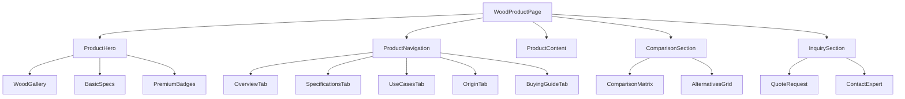
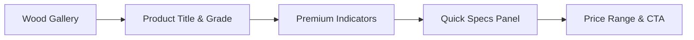

# Wood Product Directory - Comprehensive Product Pages Design Document

## 1. Overview

The Wood Product Directory transforms the current product structure from item-based (doors/windows) to wood-type-based comprehensive product pages. Each wood type gets its own detailed page with extensive information including specifications, comparisons, pros and cons, use cases, origin details, and buying guides.

### Key Features
- Individual comprehensive pages for each wood type
- Detailed specifications and properties
- Comparison matrices with other wood types
- Pros and cons analysis
- Use case recommendations
- Origin and sourcing information
- Buying guide with important considerations
- Premium positioning explanations
- Interactive comparison tools

## 2. Technology Stack & Dependencies

### Frontend Framework
- **React 18.3.1** with TypeScript
- **Vite 5.4.1** for build tooling
- **Tailwind CSS 3.4.11** for styling
- **shadcn-ui** components for consistent UI
- **React Router DOM 6.26.2** for dynamic routing

### Data Management
- Static JSON data for wood specifications
- **React Query** for data caching
- Local storage for user preferences

### Interactive Features
- **Recharts** for comparison charts
- **Framer Motion** for animations
- **React Hook Form** for inquiry forms

### SEO & Performance
- Dynamic meta tags for each wood type
- Image optimization utilities
- Lazy loading for heavy content

## 3. Component Architecture

### Wood Product Page Hierarchy



### Component Definitions

#### WoodProductPage (Main Container)
- **Purpose**: Dynamic page container for individual wood types
- **Routing**: `/products/wood/:woodType` (e.g., `/products/wood/burma-teak`)
- **Props**: `woodType: string` from URL parameters
- **Data Source**: Static wood database with comprehensive specifications

#### ProductHero
- **Purpose**: Visual showcase with key selling points
- **Features**: Image gallery, premium indicators, quick specs
- **Interactive Elements**: 360° wood grain viewer, color variations

#### ProductContent (Tabbed Interface)
- **Overview**: Summary, key benefits, premium positioning
- **Specifications**: Technical details, grades, certifications
- **Use Cases**: Applications, project examples, recommendations
- **Origin**: Source regions, harvesting methods, sustainability
- **Buying Guide**: Selection criteria, quality indicators, care instructions

## 4. Data Models & Wood Database Structure

```typescript
interface WoodProduct {
  id: string;
  name: string;
  scientificName?: string;
  category: 'teak' | 'plywood' | 'hardwood' | 'softwood';
  grade: 'premium' | 'commercial' | 'budget';
  origin: OriginInfo;
  specifications: WoodSpecifications;
  pricing: PricingInfo;
  applications: ApplicationInfo;
  sustainability: SustainabilityInfo;
  gallery: ImageGallery;
}

interface OriginInfo {
  countries: string[];
  regions: string[];
  harvestingMethod: string;
  certifications: string[];
  supplierNetwork: string[];
}

interface WoodSpecifications {
  density: number; // kg/m³
  hardness: number; // Janka hardness
  moistureContent: number; // percentage
  grainPattern: 'straight' | 'interlocked' | 'wavy';
  durability: 'class1' | 'class2' | 'class3' | 'class4' | 'class5';
  workability: 'excellent' | 'good' | 'moderate' | 'difficult';
  finishQuality: 'excellent' | 'good' | 'fair';
  dimensionalStability: 'high' | 'medium' | 'low';
  naturalResistance: {
    termites: boolean;
    decay: boolean;
    moisture: boolean;
  };
}

interface ComparisonData {
  competitors: string[];
  strengthsOverCompetitors: string[];
  considerationFactors: string[];
  priceComparison: 'higher' | 'similar' | 'lower';
}
```

## 5. Wood Product Page UI Design

### Product Hero Section



**Design Elements:**
- Full-width hero with wood texture backgrounds
- Interactive image gallery with zoom functionality
- Floating specification cards with glassmorphism
- Premium badges and certification indicators
- Gradient overlays with timber-themed colors

### Tabbed Content Structure

**Navigation Tabs:**
- Overview (Default)
- Specifications
- Applications & Use Cases
- Origin & Sustainability
- Buying Guide
- Compare with Others

**Content Layout:**
- Responsive grid system (12-column desktop, stacked mobile)
- Rich media integration (videos, 360° views, infographics)
- Interactive comparison matrices
- Expandable detail sections

### Comparison & Selection Tools

**Comparison Matrix:**
- Side-by-side property comparison
- Visual strength indicators
- Pros/cons highlighting
- Price-performance ratio charts

## 6. Wood Database Content Structure

### Burma Teak Content Example

```typescript
const burmaTeak: WoodProduct = {
  id: 'burma-teak',
  name: 'Burma Teak',
  scientificName: 'Tectona grandis',
  category: 'teak',
  grade: 'premium',
  
  overview: {
    description: "Burma Teak represents the pinnacle of premium hardwood, renowned worldwide for its exceptional durability, stunning golden-brown grain, and natural oils that provide unmatched resistance to moisture, termites, and decay.",
    keyBenefits: [
      "Superior natural durability (Class 1 rating)",
      "Rich, golden grain pattern with natural oils",
      "Excellent dimensional stability",
      "Natural termite and moisture resistance",
      "Premium finishing characteristics"
    ],
    premiumPositioning: "Burma Teak is considered the gold standard of hardwoods, preferred by luxury shipbuilders, high-end furniture makers, and premium construction projects worldwide."
  },
  
  prosAndCons: {
    pros: [
      "Exceptional longevity (100+ years with proper care)",
      "Natural weather resistance without treatment",
      "Beautiful grain that improves with age",
      "High resale and investment value",
      "Low maintenance requirements",
      "Excellent workability for complex designs"
    ],
    cons: [
      "Higher initial investment compared to alternatives",
      "Limited availability due to sustainability restrictions",
      "Requires proper sourcing verification",
      "May contain natural oils that require specific finishing"
    ]
  }
};
```

### Content Categories Matrix

| Wood Type | Premium Factor | Use Cases | Key Differentiator | Origin Specialty |
|-----------|---------------|-----------|-------------------|------------------|
| Burma Teak | Highest (5/5) | Luxury furniture, Marine | Natural durability | Myanmar forests |
| Ghana Teak | High (4/5) | Premium doors, Flooring | Cost-performance balance | West African plantations |
| Brazilian Teak | High (4/5) | Commercial projects | Sustainability certified | South American managed forests |
| Indian Sal | Medium (3/5) | Budget construction | Local availability | Indian hardwood forests |

## 7. Routing & Navigation Structure

### Dynamic Route Implementation

```typescript
// Updated App.tsx routing
const App = () => (
  <BrowserRouter>
    <Routes>
      <Route path="/" element={<Index />} />
      <Route path="/products" element={<ProductsPage />} />
      <Route path="/products/wood/:woodType" element={<WoodProductPage />} />
      <Route path="/products/category/:category" element={<CategoryPage />} />
      {/* Existing routes */}
    </Routes>
  </BrowserRouter>
);

// Wood product route examples:
// /products/wood/burma-teak
// /products/wood/ghana-teak  
// /products/wood/brazilian-teak
// /products/wood/indian-sal
// /products/wood/marine-plywood
```

### SEO Optimization

#### Dynamic Meta Tags
```typescript
const generateMetaTags = (woodProduct: WoodProduct) => ({
  title: `${woodProduct.name} - Premium Wood | New India Timber`,
  description: `${woodProduct.overview.description.substring(0, 160)}...`,
  keywords: [
    woodProduct.name,
    woodProduct.category,
    'premium wood',
    'timber supplier bangalore',
    ...woodProduct.applications.categories
  ].join(', '),
  ogImage: woodProduct.gallery.hero,
  canonicalUrl: `/products/wood/${woodProduct.id}`
});
```

### Navigation Breadcrumbs
```
Home > Products > Wood Types > Burma Teak
Home > Products > Teak Wood > Ghana Teak  
Home > Products > Plywood > Marine Plywood
```

## 8. Wood Product Content Framework

### Content Templates by Wood Type

#### Burma Teak Template
```typescript
const burmaTeakContent = {
  overview: {
    tagline: "The Gold Standard of Premium Hardwoods",
    description: "Burma Teak stands as the world's most coveted hardwood, prized for its unmatched durability, natural beauty, and exceptional resistance to the elements.",
    whyPremium: [
      "Harvested from centuries-old Myanmar forests",
      "Natural oils provide self-preservation", 
      "Class 1 durability rating - highest possible",
      "Preferred by luxury shipbuilders worldwide",
      "Investment-grade wood with appreciating value"
    ]
  },
  
  specifications: {
    botanicalName: "Tectona grandis",
    density: "600-700 kg/m³",
    hardness: "1,155 lbf (Janka)",
    grainType: "Straight to slightly interlocked",
    naturalFinish: "Golden brown with darker streaks",
    workability: "Excellent - machines and finishes beautifully",
    durability: "Class 1 (25+ years in ground contact)"
  },
  
  applications: {
    premium: ["Luxury yachts and marine applications", "High-end furniture", "Heritage building restoration"],
    commercial: ["Premium office interiors", "Hotel lobbies", "Executive boardrooms"],
    residential: ["Main entrance doors", "Staircases", "Custom built-ins"]
  },
  
  buyingGuide: {
    qualityIndicators: [
      "Rich, oily surface texture",
      "Consistent golden-brown color",
      "Minimal knots and defects",
      "Strong teak aroma",
      "Proper moisture content (8-12%)"
    ],
    importantConsiderations: [
      "Verify CITES certification for legal sourcing",
      "Check for proper kiln drying documentation",
      "Ensure grade matches intended application",
      "Factor in natural oil content for finishing",
      "Consider long-term investment value"
    ]
  }
};
```

## 9. Comparison & Selection Tools

### Interactive Comparison Matrix

```typescript
interface ComparisonMetrics {
  durability: number; // 1-5 scale
  workability: number;
  appearance: number;
  costValue: number;
  sustainability: number;
}

const comparisonData = {
  'burma-teak': {
    durability: 5,
    workability: 5, 
    appearance: 5,
    costValue: 3,
    sustainability: 3
  },
  'ghana-teak': {
    durability: 4,
    workability: 4,
    appearance: 4, 
    costValue: 4,
    sustainability: 4
  }
  // ... other woods
};
```

### Visual Comparison Tools
- **Radar Charts**: Multi-dimensional property comparison
- **Side-by-side Cards**: Direct feature comparison
- **Price-Performance Matrix**: Value positioning chart
- **Application Suitability**: Use case matching tool

### Mobile-Responsive Design

```css
/* Wood product page responsive layout */
.wood-product-container {
  @apply container mx-auto px-4;
}

.product-hero {
  @apply h-screen lg:h-96 relative overflow-hidden;
}

.product-tabs {
  @apply sticky top-16 bg-white/95 backdrop-blur z-10;
}

.comparison-matrix {
  @apply grid grid-cols-1 md:grid-cols-2 lg:grid-cols-3 gap-6;
}

/* Mobile-specific adjustments */
@screen sm {
  .wood-gallery {
    @apply aspect-square;
  }
  
  .spec-cards {
    @apply grid-cols-2;
  }
}
```

## 10. Implementation Strategy

### Phase 1: Route & Component Setup

```typescript
// Create WoodProductPage component
const WoodProductPage = () => {
  const { woodType } = useParams<{ woodType: string }>();
  const woodData = getWoodProduct(woodType);
  
  if (!woodData) {
    return <Navigate to="/products" replace />;
  }
  
  return (
    <Layout>
      <WoodProductHero wood={woodData} />
      <WoodProductTabs wood={woodData} />
      <ComparisonSection currentWood={woodData} />
      <InquirySection wood={woodData} />
    </Layout>
  );
};

// Update existing navigation links
const updatedNavigation = {
  '/products/teak/burma': '/products/wood/burma-teak',
  '/products/teak/ghana': '/products/wood/ghana-teak',
  '/products/plywood/marine': '/products/wood/marine-plywood'
};
```

### Phase 2: Content Migration
- Convert existing product data to wood-focused structure
- Create comprehensive content for each wood type
- Implement comparison matrices
- Add buying guides and expert recommendations

## 11. Performance & SEO Optimization

### Content Strategy
- **Rich Snippets**: Structured data for wood specifications
- **Image Optimization**: WebP format with lazy loading
- **Core Web Vitals**: Optimized loading and interaction metrics

### Caching Strategy
```typescript
// Wood data caching
const useWoodData = (woodType: string) => {
  return useQuery({
    queryKey: ['wood', woodType],
    queryFn: () => getWoodProduct(woodType),
    staleTime: 1000 * 60 * 60, // 1 hour
    cacheTime: 1000 * 60 * 60 * 24 // 24 hours
  });
};
```

## 12. Testing & Quality Assurance

### Content Testing
```typescript
describe('Wood Product Content', () => {
  it('displays comprehensive Burma Teak information', () => {
    render(<WoodProductPage />, {
      router: { initialEntries: ['/products/wood/burma-teak'] }
    });
    
    expect(screen.getByText('Burma Teak')).toBeInTheDocument();
    expect(screen.getByText(/Class 1 durability/)).toBeInTheDocument();
    expect(screen.getByText(/Myanmar forests/)).toBeInTheDocument();
  });
  
  it('shows accurate comparison data', () => {
    // Test comparison matrix functionality
  });
});
```

### User Experience Testing
- **A/B Testing**: Compare wood-focused vs item-focused navigation
- **Heat Mapping**: Track user interaction with comparison tools
- **Conversion Tracking**: Measure inquiry form submissions
- **Mobile Usability**: Test touch interactions and loading times


