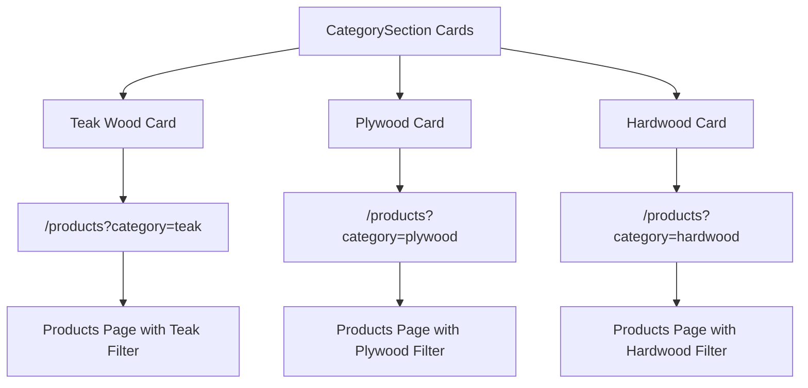
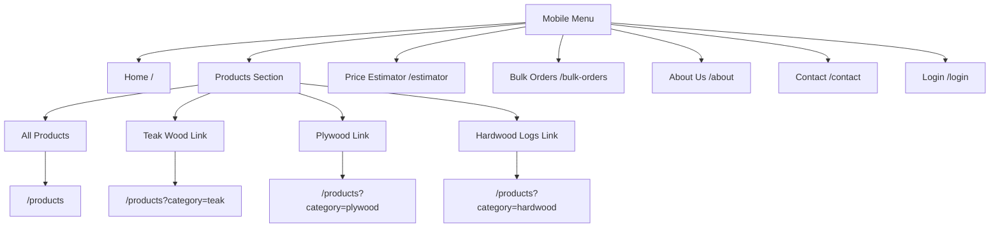
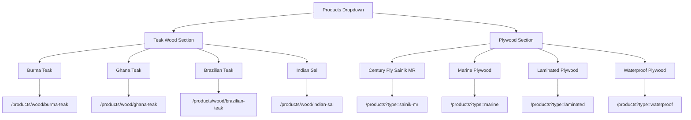
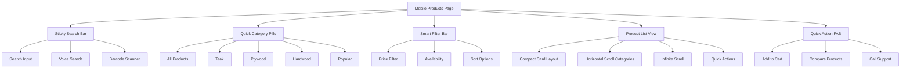

# Navigation Links Update Design

## Overview

This design addresses the update of navigation links throughout the Timber Craft Commerce Hub to ensure all menu items and "Explore collection" links on the home page properly connect to appropriate, functional pages. The current navigation system has inconsistencies between link destinations and available routes.

## Current Navigation Issues

### CategorySection "Explore Collection" Links
- Links point to `/products/teak`, `/products/plywood`, `/products/hardwood`
- These routes don't exist in the current routing configuration
- Should redirect to the main `/products` page with appropriate filters or categories

### Header Navigation Issues
- Mobile menu links to specific product subcategories (e.g., `/products/teak`)
- Desktop dropdown links to non-existent routes (e.g., `/products/teak/burma`)
- Some routes lack corresponding page implementations

### Available Routes Analysis
Current functional routes:
- `/` - Home page
- `/products` - Main products page
- `/products/wood/:woodType` - Specific wood product pages
- `/estimator` - Price estimator
- `/bulk-orders` - Bulk orders page
- `/contact` - Contact page
- `/about` - About page
- `/login` - Login page
- `/dashboard` - Dashboard page
- `/compare` - Comparison page

## Navigation Structure Update

### CategorySection Component Updates



#### Updated Category Links
| Current Link | Updated Link | Purpose |
|--------------|--------------|---------|
| `/products/teak` | `/products?category=teak` | Filter products page to show only teak products |
| `/products/plywood` | `/products?category=plywood` | Filter products page to show only plywood products |
| `/products/hardwood` | `/products?category=hardwood` | Filter products page to show only hardwood products |

### Header Navigation Updates

#### Mobile Menu Navigation Structure

The mobile menu (hamburger menu) needs comprehensive updates to align with available routes and improve user navigation experience. The current mobile menu has inconsistent links that don't match the application's routing structure.



#### Mobile Menu Implementation Requirements

**Current Mobile Menu Issues:**
- Links to `/products/teak`, `/products/plywood`, `/products/hardwood` (non-existent routes)
- Missing "All Products" option for comprehensive browsing
- Inconsistent with desktop navigation structure
- No visual hierarchy for product subcategories

**Updated Mobile Menu Structure:**
```typescript
// Enhanced mobile menu with proper routing
<nav className="flex flex-col space-y-1 flex-1">
  {/* Home Link */}
  <Link to="/" className="px-3 py-3 hover:bg-accent rounded-lg flex items-center">
    <Home className="mr-3" size={20} />
    Home
  </Link>
  
  {/* Products Section with Enhanced Structure */}
  <div className="py-2">
    <h3 className="px-3 text-sm font-semibold text-gray-500 uppercase tracking-wider mb-2">
      Products
    </h3>
    
    {/* All Products Link */}
    <Link to="/products" className="px-3 py-2 hover:bg-accent rounded-lg ml-4 flex items-center text-sm font-medium">
      <Package className="mr-2" size={16} />
      All Products
    </Link>
    
    {/* Product Categories */}
    <Link to="/products?category=teak" className="px-3 py-2 hover:bg-accent rounded-lg ml-4 flex items-center text-sm">
      Teak Wood
    </Link>
    <Link to="/products?category=plywood" className="px-3 py-2 hover:bg-accent rounded-lg ml-4 flex items-center text-sm">
      Plywood
    </Link>
    <Link to="/products?category=hardwood" className="px-3 py-2 hover:bg-accent rounded-lg ml-4 flex items-center text-sm">
      Hardwood Logs
    </Link>
    
    {/* Wood Directory Link */}
    <Link to="/products/wood/burma-teak" className="px-3 py-2 hover:bg-accent rounded-lg ml-4 flex items-center text-sm text-timber-600">
      <TreePine className="mr-2" size={16} />
      Wood Directory
    </Link>
  </div>
  
  {/* Additional Menu Items */}
  <Link to="/estimator" className="px-3 py-3 hover:bg-accent rounded-lg flex items-center">
    <Calculator className="mr-3" size={20} />
    Price Estimator
  </Link>
  
  <Link to="/bulk-orders" className="px-3 py-3 hover:bg-accent rounded-lg flex items-center">
    <ShoppingCart className="mr-3" size={20} />
    Bulk Orders
  </Link>
  
  <Link to="/compare" className="px-3 py-3 hover:bg-accent rounded-lg flex items-center">
    <BarChart3 className="mr-3" size={20} />
    Compare Woods
  </Link>
  
  <Link to="/about" className="px-3 py-3 hover:bg-accent rounded-lg flex items-center">
    <Info className="mr-3" size={20} />
    About Us
  </Link>
  
  <Link to="/contact" className="px-3 py-3 hover:bg-accent rounded-lg flex items-center">
    <Phone className="mr-3" size={20} />
    Contact
  </Link>
</nav>
```

**Mobile Menu Visual Enhancements:**
- Add icons to main navigation items for better visual recognition
- Implement visual hierarchy with proper spacing and typography
- Add "Wood Directory" quick access link
- Include "Compare Woods" functionality access
- Maintain consistent hover states and transitions

#### Desktop Navigation Dropdown


### Bottom Navigation Updates

The bottom navigation should maintain consistency with the main navigation:

| Navigation Item | Current Route | Status |
|----------------|---------------|---------|
| Home | `/` | ✅ Functional |
| Products | `/products` | ✅ Functional |
| Estimate | `/estimator` | ✅ Functional |
| Orders | `/bulk-orders` | ✅ Functional |
| Account | `/login` | ✅ Functional |
| Directions | External Google Maps | ✅ Functional |

## Mobile-First Products Page Redesign

### Current Mobile Usability Issues

The existing Products page has several mobile usability challenges that make it difficult to navigate on mobile devices:

#### Navigation & Layout Issues
- **Complex Filter Interface**: Bottom sheet filters are overwhelming with too many options presented at once
- **Poor Category Navigation**: 4-column tab layout is cramped on mobile screens
- **Information Overload**: Wood Directory cards contain too much dense information for small screens
- **Inefficient Space Usage**: Large gaps and padding waste precious mobile screen real estate
- **Touch Target Issues**: Small buttons and filter chips are difficult to tap accurately

#### Product Display Problems
- **Card Layout**: Too much information crammed into small product cards
- **Price Display**: Inconsistent pricing information presentation across products
- **Action Buttons**: Small "Buy" buttons are hard to interact with on mobile
- **Image Optimization**: Square aspect ratio not optimal for mobile product viewing
- **Loading Performance**: Heavy component structure affects scroll performance

### Mobile-First Redesign Architecture


| Home | `/` | ✅ Functional |
| Products | `/products` | ✅ Functional |
| Estimate | `/estimator` | ✅ Functional |
| Orders | `/bulk-orders` | ✅ Functional |
| Account | `/login` | ✅ Functional |
| Directions | External Google Maps | ✅ Functional |

### Redesigned Mobile Layout Structure

#### 1. Streamlined Header Section
```typescript
// Simplified mobile header with essential elements only
<div className="sticky top-16 z-30 bg-white border-b px-4 py-3">
  {/* Breadcrumb - Mobile Optimized */}
  <div className="flex items-center text-sm text-gray-500 mb-3">
    <Link to="/" className="hover:text-timber-600">Home</Link>
    <ChevronRight size={14} className="mx-1" />
    <span className="text-timber-600 font-medium">Products</span>
  </div>
  
  {/* Search Bar - Always Visible and Prominent */}
  <div className="relative mb-3">
    <Search className="absolute left-3 top-1/2 transform -translate-y-1/2 text-gray-400" size={18} />
    <input 
      type="text" 
      placeholder="Search products, wood types..."
      className="w-full pl-10 pr-12 py-3 rounded-xl border border-gray-200 focus:border-timber-500 focus:ring-2 focus:ring-timber-200 text-sm"
    />
    <Button 
      size="sm" 
      className="absolute right-2 top-1/2 transform -translate-y-1/2 h-8 px-3 bg-timber-600 hover:bg-timber-700"
    >
      <MicIcon size={14} />
    </Button>
  </div>
  
  {/* Quick Category Pills - Horizontal Scrollable */}
  <div className="flex space-x-2 overflow-x-auto pb-2 -mb-2 scrollbar-hide">
    {categories.map((category) => (
      <Button
        key={category.value}
        variant={activeCategory === category.value ? "default" : "outline"}
        size="sm"
        className={cn(
          "flex-shrink-0 rounded-full px-4 py-2 text-sm font-medium whitespace-nowrap",
          activeCategory === category.value 
            ? "bg-timber-600 text-white" 
            : "bg-white border-gray-300 text-gray-600 hover:border-timber-600"
        )}
        onClick={() => handleCategoryChange(category.value)}
      >
        <category.icon size={16} className="mr-1" />
        {category.label}
      </Button>
    ))}
  </div>
</div>
```

#### 2. Smart Filter Bar
```typescript
// Simplified and intuitive filter interface for mobile
<div className="px-4 py-3 bg-gray-50 border-b">
  <div className="flex items-center justify-between mb-3">
    <h3 className="font-medium text-gray-900 text-sm">
      {filteredProducts.length} Products
    </h3>
    
    <div className="flex items-center space-x-2">
      {/* Sort Dropdown - Simplified */}
      <Select value={sortBy} onValueChange={setSortBy}>
        <SelectTrigger className="w-28 h-9 text-xs">
          <SortAsc size={14} className="mr-1" />
          <SelectValue placeholder="Sort" />
        </SelectTrigger>
        <SelectContent>
          <SelectItem value="price-low">Price ↑</SelectItem>
          <SelectItem value="price-high">Price ↓</SelectItem>
          <SelectItem value="popular">Popular</SelectItem>
          <SelectItem value="newest">New</SelectItem>
        </SelectContent>
      </Select>
      
      {/* Filter Toggle */}
      <Sheet open={isFilterOpen} onOpenChange={setIsFilterOpen}>
        <SheetTrigger asChild>
          <Button variant="outline" size="sm" className="h-9 px-3">
            <SlidersHorizontal size={14} className="mr-1" />
            Filter
            {activeFilterCount > 0 && (
              <Badge className="ml-1 bg-timber-600 text-white text-xs w-5 h-5 flex items-center justify-center p-0">
                {activeFilterCount}
              </Badge>
            )}
          </Button>
        </SheetTrigger>
      </Sheet>
    </div>
  </div>
  
  {/* Active Filter Chips - Horizontal Scroll */}
  {activeFilterCount > 0 && (
    <div className="flex space-x-2 overflow-x-auto pb-1 scrollbar-hide">
      {activeFilters.map((filter) => (
        <Badge
          key={filter.key}
          variant="secondary"
          className="flex-shrink-0 bg-timber-100 text-timber-800 cursor-pointer hover:bg-timber-200 whitespace-nowrap"
          onClick={() => removeFilter(filter.key)}
        >
          {filter.label}
          <X size={12} className="ml-1" />
        </Badge>
      ))}
      <Button
        variant="ghost"
        size="sm"
        onClick={clearAllFilters}
        className="flex-shrink-0 h-6 px-2 text-xs text-gray-500 whitespace-nowrap"
      >
        Clear All
      </Button>
    </div>
  )}
</div>
```

#### 3. Optimized Product Card Layout
```typescript
// Mobile-optimized horizontal product cards
const MobileProductCard = ({ product }: { product: ProductType }) => {
  return (
    <Card className="mb-3 overflow-hidden border-gray-200 hover:shadow-md transition-shadow active:scale-[0.98]">
      <div className="flex p-3">
        {/* Product Image - Optimized Size */}
        <div className="w-20 h-20 flex-shrink-0 relative bg-gray-50 rounded-lg overflow-hidden">
           handleImageError(e, product.category)}
          />
          <Badge 
            className={cn(
              "absolute top-1 right-1 text-xs px-1 py-0 text-white",
              product.stockStatus === 'In Stock' ? 'bg-green-500' : 'bg-amber-500'
            )}
          >
            {product.stockStatus === 'In Stock' ? '✓' : '!'}
          </Badge>
        </div>
        
        {/* Product Information */}
        <div className="flex-1 ml-3 min-w-0">
          <div className="flex justify-between items-start mb-1">
            <h3 className="font-medium text-sm text-gray-900 line-clamp-1 pr-2">
              {product.title}
            </h3>
            <Badge 
              variant="outline" 
              className="text-xs px-1.5 py-0 flex-shrink-0"
            >
              {product.usage === 'own_premium' ? 'Premium' : 'Budget'}
            </Badge>
          </div>
          
          <p className="text-xs text-gray-600 line-clamp-2 mb-2">
            {product.description}
          </p>
          
          {/* Key Specs - Compact Display */}
          <div className="flex items-center gap-2 mb-2 text-xs text-gray-500">
            {product.thickness && (
              <span className="bg-gray-100 px-2 py-0.5 rounded">
                {product.thickness}
              </span>
            )}
            {product.color && (
              <span className="bg-gray-100 px-2 py-0.5 rounded">
                {product.color}
              </span>
            )}
          </div>
          
          {/* Price and Actions Row */}
          <div className="flex justify-between items-center">
            <div>
              {product.price ? (
                <div className="flex flex-col">
                  <span className="font-bold text-timber-600 text-sm">
                    ₹{product.price.toLocaleString('en-IN')}
                  </span>
                  {product.category === 'plywood' && (
                    <span className="text-xs text-gray-500">per sq ft</span>
                  )}
                </div>
              ) : (
                <span className="text-timber-700 font-medium text-xs bg-timber-50 px-2 py-1 rounded">
                  Get Quote
                </span>
              )}
            </div>
            
            <div className="flex items-center space-x-2">
              <Button 
                size="sm" 
                variant="ghost"
                className="h-8 w-8 p-0 hover:bg-gray-100"
                onClick={(e) => {
                  e.preventDefault();
                  toggleCompare(product.id);
                }}
              >
                <BarChart3 size={14} className="text-gray-500" />
              </Button>
              
              <Button 
                size="sm" 
                className="h-8 px-4 bg-timber-600 hover:bg-timber-700 text-xs font-medium"
                onClick={(e) => {
                  e.preventDefault();
                  addToCart(product);
                }}
              >
                <ShoppingCart size={12} className="mr-1" />
                Add
              </Button>
            </div>
          </div>
        </div>
      </div>
    </Card>
  );
};
```

### CategorySection.tsx
```typescript
const categories = [
  {
    id: "teak",
    title: "Premium Teak Wood",
    description: "Explore our collection of Burma, Ghana, Brazilian, and Indian Sal teak wood options.",
    image: getPlaceholderImage("teak"),
    link: "/products?category=teak"  // Updated from "/products/teak"
  },
  {
    id: "plywood", 
    title: "Quality Plywood",
    description: "Century Ply Sainik MR, Marine, Laminated, and Waterproof plywood solutions.",
    image: getPlaceholderImage("plywood"),
    link: "/products?category=plywood"  // Updated from "/products/plywood"
  },
  {
    id: "hardwood",
    title: "Hardwood Logs", 
    description: "Various hardwood logs perfect for custom projects and specialized needs.",
    image: getPlaceholderImage("hardwood"),
    link: "/products?category=hardwood"  // Updated from "/products/hardwood"
  }
];
```

### Header.tsx Mobile Menu Complete Implementation

```typescript
import { 
  Home, 
  Package, 
  Calculator, 
  ShoppingCart, 
  User, 
  Phone, 
  Mail, 
  Info, 
  TreePine, 
  BarChart3 
} from "lucide-react";

// Complete mobile menu implementation with enhanced structure
<SheetContent side="right" className="w-80">
  <div className="flex flex-col h-full">
    <div className="flex items-center mb-6">
      <h2 className="text-xl font-bold">Menu</h2>
    </div>
    
    <nav className="flex flex-col space-y-1 flex-1">
      {/* Home Link */}
      <Link to="/" className="px-3 py-3 hover:bg-accent rounded-lg flex items-center">
        <Home className="mr-3" size={20} />
        Home
      </Link>
      
      {/* Enhanced Products Section */}
      <div className="py-2">
        <h3 className="px-3 text-sm font-semibold text-gray-500 uppercase tracking-wider mb-2">
          Products
        </h3>
        
        {/* All Products - New Addition */}
        <Link to="/products" className="px-3 py-2 hover:bg-accent rounded-lg ml-4 flex items-center text-sm font-medium">
          <Package className="mr-2" size={16} />
          All Products
        </Link>
        
        {/* Updated Category Links */}
        <Link to="/products?category=teak" className="px-3 py-2 hover:bg-accent rounded-lg ml-4 flex items-center text-sm">
          Teak Wood
        </Link>
        <Link to="/products?category=plywood" className="px-3 py-2 hover:bg-accent rounded-lg ml-4 flex items-center text-sm">
          Plywood
        </Link>
        <Link to="/products?category=hardwood" className="px-3 py-2 hover:bg-accent rounded-lg ml-4 flex items-center text-sm">
          Hardwood Logs
        </Link>
        
        {/* Wood Directory Access - New Addition */}
        <Link to="/products/wood/burma-teak" className="px-3 py-2 hover:bg-accent rounded-lg ml-4 flex items-center text-sm text-timber-600">
          <TreePine className="mr-2" size={16} />
          Wood Directory
        </Link>
      </div>
      
      {/* Main Navigation Items with Icons */}
      <Link to="/estimator" className="px-3 py-3 hover:bg-accent rounded-lg flex items-center">
        <Calculator className="mr-3" size={20} />
        Price Estimator
      </Link>
      
      <Link to="/bulk-orders" className="px-3 py-3 hover:bg-accent rounded-lg flex items-center">
        <ShoppingCart className="mr-3" size={20} />
        Bulk Orders
      </Link>
      
      {/* Compare Feature - New Addition */}
      <Link to="/compare" className="px-3 py-3 hover:bg-accent rounded-lg flex items-center">
        <BarChart3 className="mr-3" size={20} />
        Compare Woods
      </Link>
      
      <Link to="/about" className="px-3 py-3 hover:bg-accent rounded-lg flex items-center">
        <Info className="mr-3" size={20} />
        About Us
      </Link>
      
      <Link to="/contact" className="px-3 py-3 hover:bg-accent rounded-lg flex items-center">
        <Phone className="mr-3" size={20} />
        Contact
      </Link>
    </nav>
    
    {/* Footer Section with Login */}
    <div className="border-t pt-4 mt-4">
      <Link to="/login" className="px-3 py-3 hover:bg-accent rounded-lg flex items-center">
        <User className="mr-3" size={20} />
        Login / Register
      </Link>
      
      {/* Contact Information */}
      <div className="px-3 py-2 text-xs text-gray-500">
        <div className="flex items-center mb-1">
          <Phone size={12} className="mr-1" />
          +91 8095701235
        </div>
        <div className="flex items-center">
          <Mail size={12} className="mr-1" />
          contact@newindiatimber.com
        </div>
      </div>
    </div>
  </div>
</SheetContent>
```

**Mobile Menu Key Improvements:**
1. **All Products Link**: Added comprehensive product browsing option
2. **Category Filtering**: Updated links to use query parameters for proper filtering
3. **Wood Directory Access**: Quick access to detailed wood information
4. **Compare Feature**: Direct access to wood comparison tool
5. **Visual Icons**: Added icons to all main navigation items
6. **Enhanced Typography**: Improved visual hierarchy with proper spacing
7. **Contact Integration**: Maintained contact information in footer section

### Header.tsx Desktop Dropdown
```typescript
// Updated desktop dropdown links for specific wood types
<li><Link to="/products/wood/burma-teak" className="hover:text-timber-600">Burma Teak</Link></li>
<li><Link to="/products/wood/ghana-teak" className="hover:text-timber-600">Ghana Teak</Link></li>
<li><Link to="/products/wood/brazilian-teak" className="hover:text-timber-600">Brazilian Teak</Link></li>
<li><Link to="/products/wood/indian-sal" className="hover:text-timber-600">Indian Sal</Link></li>

// Updated plywood links to use query parameters
<li><Link to="/products?type=sainik-mr" className="hover:text-timber-600">Century Ply Sainik MR</Link></li>
<li><Link to="/products?type=marine" className="hover:text-timber-600">Marine Plywood</Link></li>
<li><Link to="/products?type=laminated" className="hover:text-timber-600">Laminated Plywood</Link></li>
<li><Link to="/products?type=waterproof" className="hover:text-timber-600">Waterproof Plywood</Link></li>
```

## ProductsPage Enhancement

### Query Parameter Handling
The ProductsPage component should be enhanced to handle the new query parameters:

```typescript
// Enhanced filtering logic
const searchParams = new URLSearchParams(location.search);
const categoryFilter = searchParams.get('category');
const typeFilter = searchParams.get('type');

// Apply filters based on URL parameters
useEffect(() => {
  if (categoryFilter) {
    setActiveCategory(categoryFilter);
  }
  if (typeFilter) {
    // Apply product type filter
    setProductTypeFilter(typeFilter);
  }
}, [categoryFilter, typeFilter]);
```

### Enhanced Mobile Filter Interface

```typescript
// Redesigned mobile filter sheet with better UX
<SheetContent side="bottom" className="h-[85vh] p-0">
  <div className="flex flex-col h-full">
    <SheetHeader className="px-4 py-4 border-b">
      <div className="flex justify-between items-center">
        <SheetTitle className="text-lg font-medium">Filter Products</SheetTitle>
        <Button 
          variant="ghost" 
          size="sm" 
          onClick={clearAllFilters}
          className="text-sm text-gray-500 hover:text-gray-700"
        >
          Clear All
        </Button>
      </div>
    </SheetHeader>
    
    <div className="flex-1 overflow-y-auto px-4 py-6 space-y-8">
      {/* Price Range - Visual Slider */}
      <div>
        <h4 className="font-medium mb-4 text-base flex items-center">
          <DollarSign size={18} className="mr-2 text-timber-600" />
          Price Range
        </h4>
        <div className="px-3">
          <Slider
            value={priceRange}
            onValueChange={setPriceRange}
            max={100000}
            min={0}
            step={5000}
            className="w-full mb-3"
          />
          <div className="flex justify-between text-sm text-gray-600">
            <span className="font-medium">₹{priceRange[0].toLocaleString()}</span>
            <span className="font-medium">₹{priceRange[1].toLocaleString()}</span>
          </div>
        </div>
      </div>
      
      {/* Usage Type - Enhanced Toggle Buttons */}
      <div>
        <h4 className="font-medium mb-4 text-base flex items-center">
          <Star size={18} className="mr-2 text-timber-600" />
          Quality Level
        </h4>
        <div className="grid grid-cols-2 gap-3">
          {[
            { value: 'own_premium', label: 'Premium', desc: 'High-end quality', icon: Crown },
            { value: 'own_budget', label: 'Budget', desc: 'Cost-effective', icon: Wallet }
          ].map(({ value, label, desc, icon: Icon }) => (
            <Button
              key={value}
              variant={selectedUsage.includes(value) ? "default" : "outline"}
              className={cn(
                "h-16 p-4 flex flex-col items-center justify-center",
                selectedUsage.includes(value)
                  ? "bg-timber-600 text-white border-timber-600"
                  : "border-gray-300 hover:border-timber-600"
              )}
              onClick={() => toggleUsageFilter(value)}
            >
              <Icon size={20} className="mb-1" />
              <div className="text-center">
                <div className="text-sm font-semibold">{label}</div>
                <div className="text-xs opacity-75">{desc}</div>
              </div>
            </Button>
          ))}
        </div>
      </div>
      
      {/* Category Filter - Visual Selection */}
      <div>
        <h4 className="font-medium mb-4 text-base flex items-center">
          <Package size={18} className="mr-2 text-timber-600" />
          Product Category
        </h4>
        <div className="space-y-3">
          {[
            { value: 'teak', label: 'Teak Wood', icon: TreePine, count: 45 },
            { value: 'plywood', label: 'Plywood', icon: Layers, count: 32 },
            { value: 'hardwood', label: 'Hardwood Logs', icon: Mountain, count: 18 }
          ].map(({ value, label, icon: Icon, count }) => (
            <div 
              key={value}
              className={cn(
                "flex items-center justify-between p-4 rounded-lg border-2 cursor-pointer transition-all",
                selectedCategories.includes(value)
                  ? "border-timber-600 bg-timber-50"
                  : "border-gray-200 hover:border-gray-300"
              )}
              onClick={() => toggleCategoryFilter(value)}
            >
              <div className="flex items-center space-x-3">
                <div className={cn(
                  "p-2 rounded-lg",
                  selectedCategories.includes(value) ? "bg-timber-600 text-white" : "bg-gray-100 text-gray-600"
                )}>
                  <Icon size={20} />
                </div>
                <div>
                  <div className="font-medium text-sm">{label}</div>
                  <div className="text-xs text-gray-500">{count} products</div>
                </div>
              </div>
              <Checkbox 
                checked={selectedCategories.includes(value)}
                className="w-5 h-5"
              />
            </div>
          ))}
        </div>
      </div>
    </div>
    
    {/* Fixed Bottom Actions */}
    <div className="border-t bg-white p-4">
      <div className="flex space-x-3">
        <Button 
          variant="outline" 
          className="flex-1 h-12"
          onClick={() => setIsFilterOpen(false)}
        >
          Cancel
        </Button>
        <Button 
          className="flex-2 h-12 bg-timber-600 hover:bg-timber-700"
          onClick={applyFilters}
        >
          Show {getFilteredCount()} Products
        </Button>
      </div>
    </div>
  </div>
</SheetContent>
```

### Mobile Performance Optimizations

#### Infinite Scroll with Intersection Observer
```typescript
// Optimized infinite scroll implementation
const useInfiniteScroll = () => {
  const [displayedProducts, setDisplayedProducts] = useState(20);
  const [isLoading, setIsLoading] = useState(false);
  const [hasMore, setHasMore] = useState(true);
  const loadMoreRef = useRef<HTMLDivElement>(null);
  
  const loadMoreProducts = useCallback(() => {
    if (isLoading || !hasMore) return;
    
    setIsLoading(true);
    // Simulate API delay
    setTimeout(() => {
      const newCount = displayedProducts + 20;
      setDisplayedProducts(newCount);
      setHasMore(newCount < filteredProducts.length);
      setIsLoading(false);
    }, 300);
  }, [isLoading, hasMore, displayedProducts, filteredProducts.length]);
  
  useEffect(() => {
    const observer = new IntersectionObserver(
      (entries) => {
        if (entries[0].isIntersecting && hasMore) {
          loadMoreProducts();
        }
      },
      { threshold: 0.1, rootMargin: '100px' }
    );
    
    if (loadMoreRef.current) {
      observer.observe(loadMoreRef.current);
    }
    
    return () => observer.disconnect();
  }, [loadMoreProducts, hasMore]);
  
  return { displayedProducts, isLoading, hasMore, loadMoreRef };
};
```

#### Quick Action Floating Button
```typescript
// Floating Action Button for essential mobile actions
<div className="md:hidden fixed bottom-20 right-4 z-40 space-y-3">
  {/* Compare Products Floating Button */}
  {compareList.length > 0 && (
    <div className="relative">
      <Button
        size="lg"
        className="w-14 h-14 rounded-full shadow-xl bg-white border-2 border-gray-200 text-gray-600 hover:bg-gray-50"
        onClick={() => setIsCompareOpen(true)}
      >
        <BarChart3 size={24} />
      </Button>
      <Badge className="absolute -top-2 -right-2 w-6 h-6 flex items-center justify-center p-0 bg-timber-600 text-white text-xs font-bold">
        {compareList.length}
      </Badge>
    </div>
  )}
  
  {/* Quick Support Call */}
  <Button
    size="lg"
    className="w-14 h-14 rounded-full shadow-xl bg-timber-600 hover:bg-timber-700 text-white"
    onClick={() => window.open('tel:+918095701235')}
  >
    <Phone size={24} />
  </Button>
</div>
```

### Voice Search Integration
```typescript
// Voice search capability for mobile users
const useVoiceSearch = () => {
  const [isListening, setIsListening] = useState(false);
  const [transcript, setTranscript] = useState('');
  
  const startVoiceSearch = useCallback(() => {
    if ('webkitSpeechRecognition' in window || 'SpeechRecognition' in window) {
      const SpeechRecognition = window.webkitSpeechRecognition || window.SpeechRecognition;
      const recognition = new SpeechRecognition();
      
      recognition.continuous = false;
      recognition.interimResults = false;
      recognition.lang = 'en-IN';
      
      recognition.onstart = () => {
        setIsListening(true);
        // Haptic feedback if available
        if ('vibrate' in navigator) {
          navigator.vibrate(50);
        }
      };
      
      recognition.onend = () => setIsListening(false);
      
      recognition.onresult = (event) => {
        const result = event.results[0][0].transcript;
        setTranscript(result);
        setSearchQuery(result);
        performSearch(result);
      };
      
      recognition.onerror = () => {
        setIsListening(false);
        toast.error('Voice search failed. Please try again.');
      };
      
      recognition.start();
    } else {
      toast.error('Voice search not supported on this device.');
    }
  }, []);
  
  return { startVoiceSearch, isListening, transcript };
};
```

### Mobile Navigation Consistency Matrix

| Mobile Menu Item | Current Link | Updated Link | Icon | Status |
|------------------|--------------|--------------|------|--------|
| Home | `/` | `/` | Home | ✅ Functional |
| All Products | Missing | `/products` | Package | 🆕 New Addition |
| Teak Wood | `/products/teak` | `/products?category=teak` | None | 🔄 Update Required |
| Plywood | `/products/plywood` | `/products?category=plywood` | None | 🔄 Update Required |
| Hardwood Logs | `/products/hardwood` | `/products?category=hardwood` | None | 🔄 Update Required |
| Wood Directory | Missing | `/products/wood/burma-teak` | TreePine | 🆕 New Addition |
| Price Estimator | `/estimator` | `/estimator` | Calculator | ✅ Functional |
| Bulk Orders | `/bulk-orders` | `/bulk-orders` | ShoppingCart | ✅ Functional |
| Compare Woods | Missing | `/compare` | BarChart3 | 🆕 New Addition |
| About Us | `/about` | `/about` | Info | ✅ Functional |
| Contact | `/contact` | `/contact` | Phone | ✅ Functional |
| Login/Register | `/login` | `/login` | User | ✅ Functional |

### Navigation Consistency Matrix

| Component | Link Type | Current Destination | Updated Destination | Status |
|-----------|-----------|-------------------|-------------------|---------|
| CategorySection | Explore Collection | `/products/teak` | `/products?category=teak` | 🔄 Update Required |
| CategorySection | Explore Collection | `/products/plywood` | `/products?category=plywood` | 🔄 Update Required |
| CategorySection | Explore Collection | `/products/hardwood` | `/products?category=hardwood` | 🔄 Update Required |
| Header Mobile | Product Link | `/products/teak` | `/products?category=teak` | 🔄 Update Required |
| Header Mobile | Product Link | `/products/plywood` | `/products?category=plywood` | 🔄 Update Required |
| Header Mobile | Product Link | `/products/hardwood` | `/products?category=hardwood` | 🔄 Update Required |
| Header Desktop | Teak Types | `/products/teak/*` | `/products/wood/*` | 🔄 Update Required |
| Header Desktop | Plywood Types | `/products/plywood/*` | `/products?type=*` | 🔄 Update Required |
| Footer | Product Links | Various | Consistent with header | 🔄 Update Required |

## User Experience Impact

### Improved Navigation Flow
1. **Consistent Routing**: All navigation links will point to functional pages
2. **Filter Integration**: Category and type filters will work seamlessly with the products page
3. **Breadcrumb Support**: Enhanced navigation will support better breadcrumb implementation
4. **Deep Linking**: Users can bookmark and share filtered product views

### Search Engine Optimization
1. **Clean URLs**: Query parameter approach maintains clean, indexable URLs
2. **Category Pages**: Proper category filtering improves SEO for product categories
3. **Internal Linking**: Consistent internal linking structure improves site architecture

## Testing Requirements

### Navigation Testing
- [ ] Verify all CategorySection "Explore Collection" buttons navigate correctly
- [ ] Test mobile menu product category links  
- [ ] Test desktop dropdown navigation for all product types
- [ ] Verify query parameter handling on ProductsPage
- [ ] Test deep linking with query parameters
- [ ] Verify breadcrumb functionality with new routing

### Mobile Menu Specific Testing
- [ ] Test hamburger menu open/close functionality
- [ ] Verify all mobile menu links navigate to correct pages
- [ ] Test "All Products" link functionality
- [ ] Test category filter links (teak, plywood, hardwood)
- [ ] Verify "Wood Directory" navigation
- [ ] Test "Compare Woods" feature access
- [ ] Verify mobile menu visual hierarchy and spacing
- [ ] Test icon display and alignment in mobile menu
- [ ] Verify contact information display in mobile menu footer
- [ ] Test mobile menu scrolling behavior on small screens
- [ ] Verify mobile menu sheet overlay and backdrop functionality

### Cross-Device Testing
- [ ] Mobile navigation consistency
- [ ] Desktop dropdown functionality
- [ ] Tablet responsive navigation
- [ ] Touch interaction testing

### Performance Testing  
- [ ] Navigation transition smoothness
- [ ] Page load times with query parameters
- [ ] Client-side routing performance